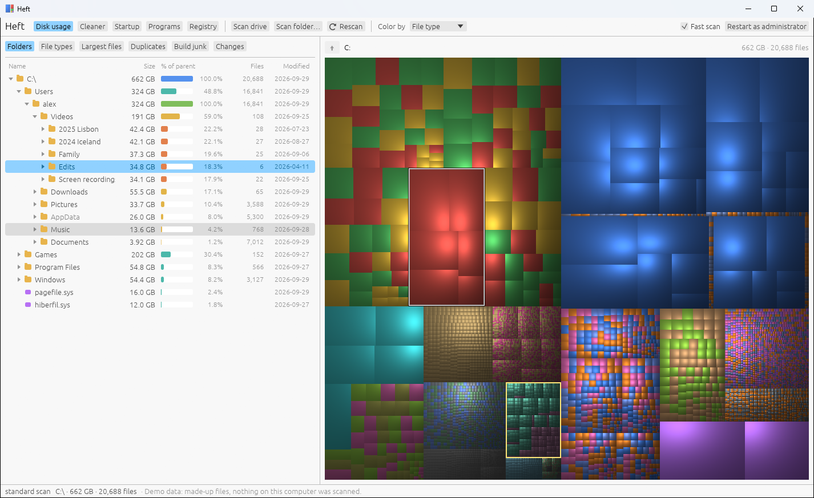
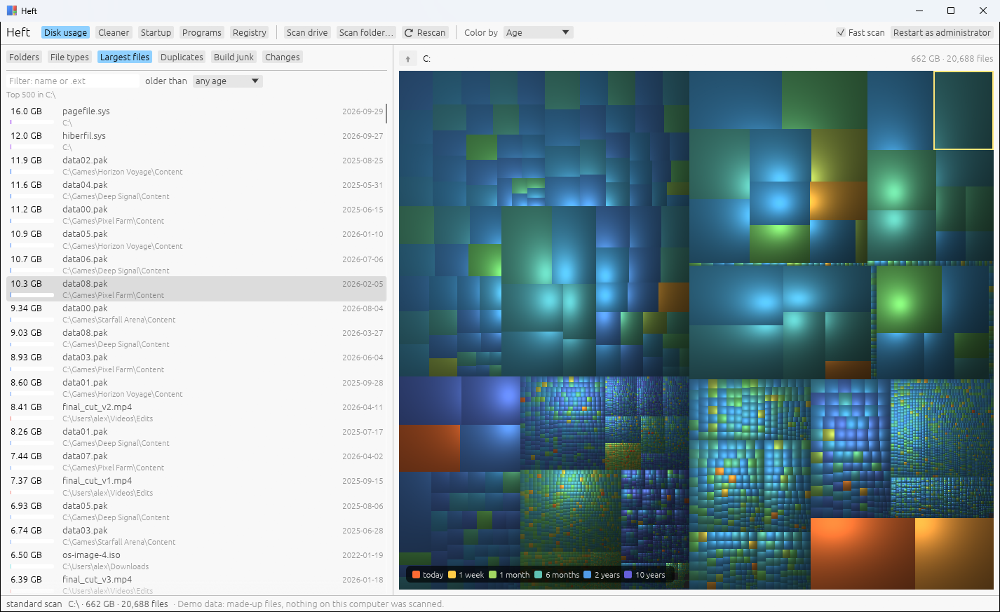

# Heft

[](https://ko-fi.com/gnail)

Heft is a disk usage analyzer and cleanup tool. It runs on Windows today, and
macOS and Linux builds are in progress.

The goal of the project is to improve disk management and make it easier to
keep your computer clean and organized: see where your space went, find what
you don't need, and remove it without surprises.



The screenshots use Heft's demo disk (`HEFT_DEMO=1`). All the files in them
are made up.

## Features

Disk usage (Windows, macOS, Linux):

- A treemap of every file, sized by the space it uses. Click to select,
  double-click to zoom in, Backspace to zoom out. Color by file type,
  category, age, or growth since a previous scan.
- A folder tree with sizes, percentages, file counts and modification dates.
- A breakdown by file type.
- The largest files, filterable by name, extension and age.
- A duplicate finder. Files are compared by size, then by sampled content,
  then by a full hash. Hard links aren't reported as duplicates.
- Build junk: `node_modules`, Cargo `target` directories, game engine caches
  and other folders that can be regenerated. A folder is only listed when the
  project around it confirms what it is.
- Scan history. Heft saves a small snapshot after each scan, and the Changes
  tab shows which folders grew or shrank since an earlier one.
- Delete to the Recycle Bin or Trash, with a warning for system folders.

Maintenance (Windows only):

- Junk cleaner for temporary files, caches and logs. It works from a fixed
  list of known locations and shows what it found before removing anything.
  These files are deleted permanently rather than recycled, and the
  confirmation dialog says so. Files in use are skipped, and so are rules for
  programs that are running.
- Startup programs: Run keys, Startup folders, and scheduled tasks that run at
  logon or boot. Items are turned off with the same setting Task Manager uses,
  so nothing is deleted.
- Installed programs: sizes, uninstalling, a check for leftover files
  afterwards, and updates through winget. Leftover suggestions never include
  a folder that belongs to another installed program.
- Registry issues: a narrow check for entries that point to files that no
  longer exist. A `.reg` backup is saved before every change. This is
  housekeeping; it won't make your PC faster.



## Speed and accuracy

On Windows, when run as administrator on an NTFS drive, Heft reads the master
file table directly instead of listing every folder. On a 1.5 TB drive with
2.7 million files that takes about 6 seconds, compared to about 30 seconds for
a regular directory scan. Without administrator rights, and on macOS and
Linux, Heft scans folders in parallel.

Sizes are counted carefully:

- Hard-linked files are counted once. On the test drive a plain directory scan
  over-counted by about 24 GB, mostly from the Windows component store.
- Online-only files from OneDrive, Dropbox and iCloud count as 0 bytes on disk
  and are never read.
- Folders that appear at two paths (bind mounts, macOS firmlinks) are counted
  once, and virtual file systems such as `/proc` are skipped.
- The MFT scan includes `System Volume Information` (shadow copies) and NTFS
  metadata files, which a directory scan can't open.

## Building

There are no release binaries yet, so you need to build from source.

1. Install Rust from <https://rustup.rs>. On Windows you also need the Visual
   Studio "Desktop development with C++" build tools.
2. Build:

   ```
   cargo build --release
   ```

3. Run `target/release/heft` (`heft.exe` on Windows).

On macOS, `bash scripts/bundle-macos.sh` builds `target/Heft.app`. Give it
Full Disk Access in System Settings > Privacy & Security if you want protected
folders such as Mail included in scans.

On Linux, `bash scripts/install-linux.sh` installs Heft to `~/.local/bin` and
adds it to your app launcher. It doesn't need root.

To look around without scanning anything, run `HEFT_DEMO=1 heft`.

## Platform support

| | Windows | macOS | Linux |
|---|---|---|---|
| Disk usage | Yes | Builds, untested on real hardware | Builds, untested on real hardware |
| Fast MFT scan | Yes (admin, NTFS) | No | No |
| Cleaner, startup, programs, registry | Yes | No | No |

The macOS and Linux builds are new. They compile, their scanner is covered by
the test suite, and CI builds and tests them on every push, but nobody has run
them on a real Mac or Linux desktop yet. Reports are welcome.

## Usage

Pick a drive or your home folder on the start screen, choose any folder, or
drop a folder onto the window. Right-click anything for Show in
Explorer/Finder, Open, Copy path, or Move to Recycle Bin/Trash.

| Key | Action |
|---|---|
| Up / Down | Move through the folder tree |
| Right / Left | Expand / collapse |
| Enter | Zoom into the selection |
| Backspace, mouse back | Zoom out |
| Delete (Cmd+Backspace on macOS) | Move the selection to the Recycle Bin / Trash (asks first) |
| Esc | Clear the highlight |

Command line:

```
heft [path]                         open Heft, optionally scanning path
heft --bench <path> [--walk]        scan and print a summary with timings
heft --compare <path>               compare the MFT scan with a directory scan (Windows, admin)
heft --render <path> <out.png>      save a treemap image
heft --clean [--dry-run]            run the saved junk cleaner selection (Windows)
heft --icon <out.png> [--size N]    write the app icon (used by the packaging scripts)
```

## Privacy

Heft runs locally. It has no analytics or accounts and doesn't send data
anywhere. The only network access is winget, when you check for or install
software updates.

Heft stores:

- scan snapshots for the Changes tab, in `%LOCALAPPDATA%\Heft\history`
  (Windows), `~/Library/Application Support/Heft/history` (macOS) or
  `~/.local/share/heft/history` (Linux);
- on Windows, your junk cleaner selection and registry backups, in
  `%LOCALAPPDATA%\Heft\cleaner.txt` and `%LOCALAPPDATA%\Heft\backups`.

## How it works

The MFT scanner opens the volume, reads the master file table in 4 MB chunks
in parallel with unbuffered I/O, and rebuilds the folder tree from each
record's parent reference. It checks record sequence numbers so reused records
don't end up in the wrong folder, and takes the sizes of busy system files
such as `pagefile.sys` from a normal directory listing, because their MFT
records can be out of date.

The directory scanners list folders on many threads at once. On Windows they
use `GetFileInformationByHandleEx`, which returns hundreds of entries per
call; on macOS and Linux they use `readdir` and `lstat`.

The treemap uses the squarified layout and van Wijk's cushion shading, and is
drawn on a background thread. Scan snapshots store every folder plus files
over 16 MB, compressed with LZ4.

See [CONTRIBUTING.md](CONTRIBUTING.md) for the source layout.

## Contributing

Bug reports and pull requests are welcome. Because Heft deletes files and
edits the registry, changes in those areas get extra scrutiny.
[CONTRIBUTING.md](CONTRIBUTING.md) covers building, testing on each platform,
and the rules for anything that removes data. Please report problems that
could delete the wrong files privately; see [SECURITY.md](SECURITY.md).

Participation is covered by the [Code of Conduct](CODE_OF_CONDUCT.md).

## Support

Heft is free. If it saved you some space and you'd like to say thanks, you can
[buy me a coffee on Ko-fi](https://ko-fi.com/gnail).

## License

[MIT](LICENSE).

Heft borrows its central idea, the cushion treemap, from
[WinDirStat](https://windirstat.net/), and the MFT scanning approach from
[WizTree](https://diskanalyzer.com/).
