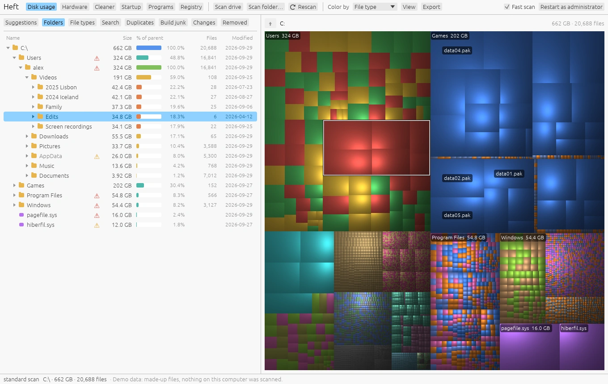
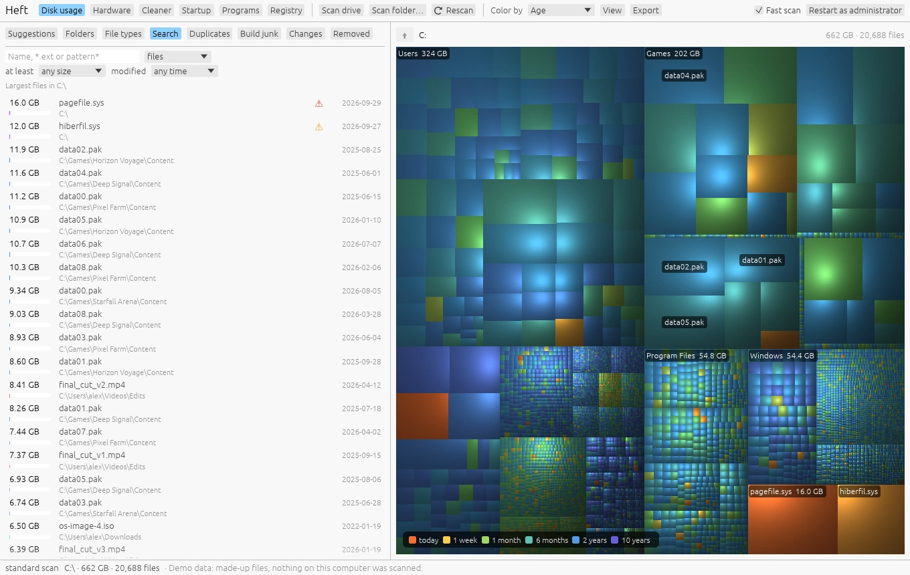
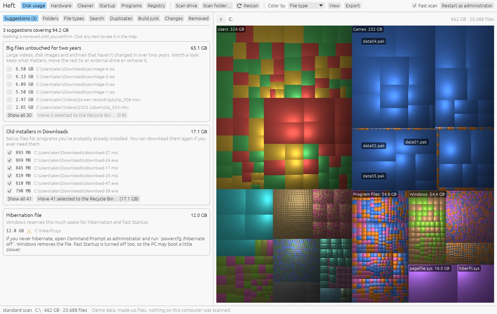
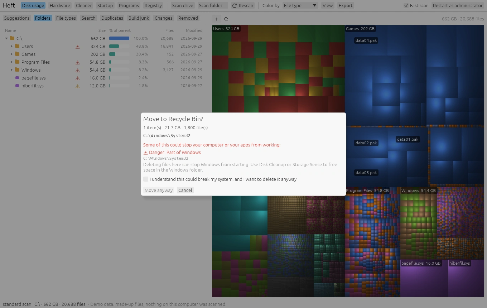
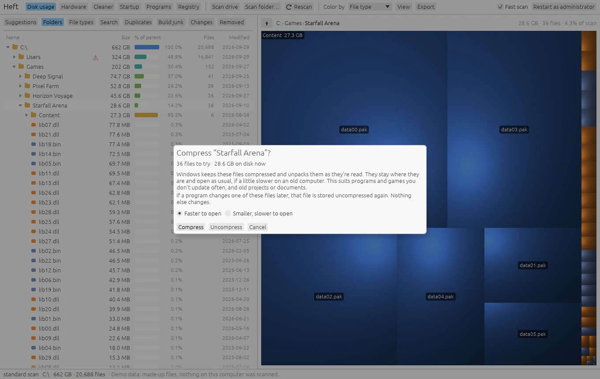
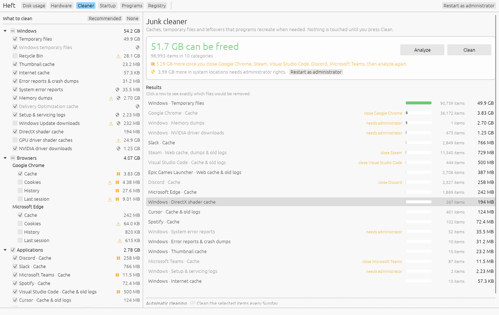
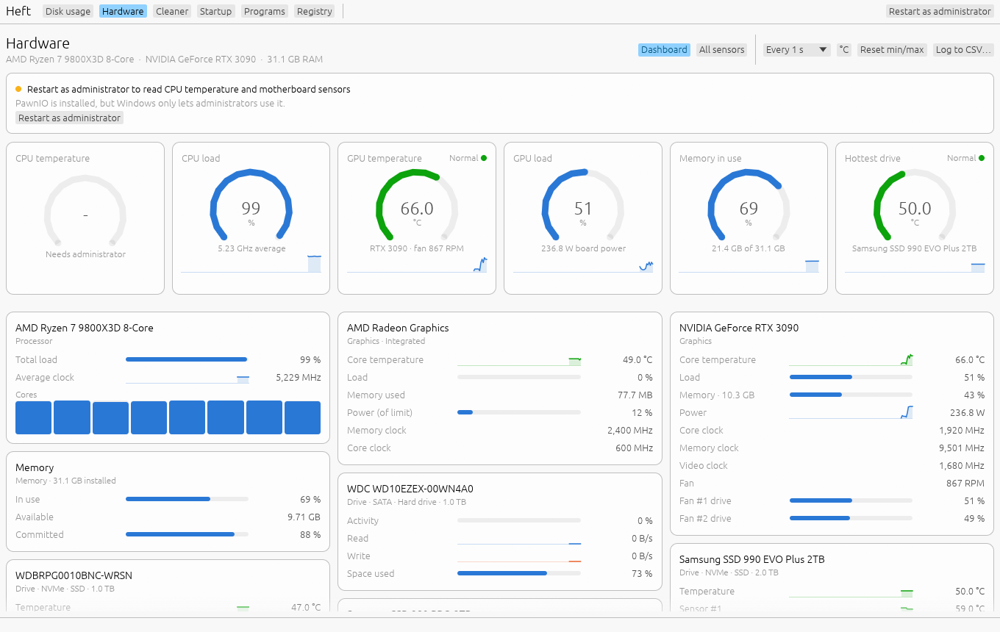

# Heft

[](https://ko-fi.com/gnail)

Heft is a disk usage analyzer and PC cleaner. It shows where your space went,
finds what you don't need, and removes it without surprises. It also has a
hardware monitor and, on Windows and macOS, tools for what starts when you
sign in, installed programs, and entries left pointing at programs you've
deleted (the registry on Windows).

Heft runs on Windows and macOS. A Linux build is in progress.

**[Website](https://gjnail.github.io/heft/)** ·
**[Tutorial](https://gjnail.github.io/heft/tutorial.html)** ·
**[Guides](https://gjnail.github.io/heft/guides/)** ·
**[FAQ](https://gjnail.github.io/heft/faq.html)** ·
**[Download](https://github.com/gjnail/heft/releases/latest)**

It tries to be the careful option: it explains what something is before you
remove it, sends files to the Recycle Bin or Trash whenever it can, backs up
every registry or settings change, and tells you plainly when a cleanup won't make much
difference.



The disk usage screenshots use Heft's demo disk (`HEFT_DEMO=1`), so all the
files in them are made up. The Cleaner and Hardware screenshots are from a real
PC.

## What's in Heft

| Page | What it does | Runs on |
|---|---|---|
| [Disk usage](#disk-usage) | Treemap and folder tree, cleanup suggestions, search, duplicates, build junk, scan history | Windows, macOS, Linux |
| [Cleaner](#cleaner) | Caches, temporary files and logs from a list of known locations | Windows, macOS, Linux |
| [Hardware](#hardware-monitor) | Temperatures, load, power, fans and every other sensor, live | Windows, macOS, Linux |
| [Startup](#startup), [Login items](#login-items) | What runs when you sign in, and turning it off | Windows, macOS |
| [Programs](#programs), [Apps](#apps) | Real install sizes, uninstalling with a leftover check, updates through winget or Homebrew | Windows, macOS |
| [Registry](#registry) | A narrow check for entries that point at missing files, with backups | Windows |
| [Broken items](#broken-items) | The same check for launch agents, login items, links and records, with backups | macOS |

See [Platform support](#platform-support) for what has been tested where.

## Disk usage

### Scanning

Pick a drive or your home folder on the start screen, choose any folder, or
drop a folder onto the window.

On Windows, run as administrator on an NTFS drive and Heft reads the master
file table directly, which takes seconds instead of minutes (see
[Speed and accuracy](#speed-and-accuracy)). After a fast scan, Rescan reads
only what the NTFS change journal says has changed, and View > Update
automatically keeps the map current while Heft is open.

On macOS the same works after any scan of a local disk: Rescan only lists
again the folders the file system has logged changes in since the last scan
(FSEvents, which needs no permission), and View > Update automatically keeps
the map current. Network shares get a full scan.

### Treemap

Every file is a rectangle sized by the space it uses, shaded so that folders
stand out as groups.

- Click to select, double-click or Enter to zoom in, Backspace or the mouse
  back button to zoom out. With the treemap focused, the arrow keys move
  between rectangles. Hover over anything for its size and path.
- Color by file type, by category (video, images, audio, archives, documents,
  code, programs, game data, system), by age, or by growth since an earlier
  scan.
- Size rectangles by file size or by space on disk. Compressed, sparse and
  online-only files take less room than their size suggests.
- Large rectangles are labeled with their names (View menu).
- Right-click for Zoom into folder, Show in Explorer or Finder, Open, Copy
  path, Highlight all files of that type, Compress, Move to another drive, and
  Move to Recycle Bin or Trash.



More in the guide: [Finding what uses space](https://gjnail.github.io/heft/guides/disk-usage.html).

### Suggestions

The Suggestions tab turns a scan into a short list of things worth doing, each
with the space it would free and the reason it's there:

- old installers in Downloads, and repeated downloads such as
  `report (1).pdf` next to an identical `report.pdf`;
- `node_modules`, build output and caches in projects you haven't changed in
  six months;
- Steam games you haven't played in a year (Heft reads Steam's small manifest
  files to find out when a game was last played);
- very large log files and crash dumps;
- big videos, disk images and archives that haven't changed in two years;
- temporary files and caches that the [Cleaner](#cleaner) would remove;
- a Recycle Bin or Trash that's full of old files;
- large WSL, Docker and virtual machine disks, which grow but don't shrink by
  themselves;
- on Windows, a leftover `Windows.old` folder and the hibernation file, with
  the steps to remove them using Windows' own tools;
- on macOS, old macOS installers, iPhone and iPad software downloads, iPhone
  backups, Time Machine's local snapshots, the hibernation image, Docker
  Desktop's disk, Messages attachments, Xcode archives, Mail downloads, the
  Photos library and big iCloud Drive files kept on the Mac, with the right
  way to deal with each;
- programs, apps and games you haven't updated in three months, which can be
  [compressed](#freeing-space-without-deleting) in place.

Only clearly disposable items are pre-selected, and never anything that comes
with a warning. Anything that could break your system is left out, and
nothing is removed until you confirm.



### Folders, file types and search

- **Folders:** the folder tree with sizes, percentages, file counts and the
  date anything inside last changed.
- **File types:** space by category and by extension. Click one to highlight
  those files in the treemap.
- **Search:** find files and folders across the whole scan by name, extension
  or pattern (`*.iso`, `backup*`), minimum size and age. With no search text,
  it lists the largest files. Everything that matches can go to the Recycle
  Bin or Trash in one step.

### Duplicates

Files are compared by size, then by a sample of their content, then by a full
hash. Hard links aren't reported, since they're already one file. "Select all
but the oldest" keeps the oldest copy in every group. The extra copies can go to
the Recycle Bin or Trash, or be replaced with links so every copy stays where
it is (see [Freeing space without deleting](#freeing-space-without-deleting)).

### Build junk

Folders that build tools and package managers can regenerate:

- `node_modules` and JavaScript build caches (`.next`, `.nuxt`, `.vite`,
  `.turbo`, `.svelte-kit`, `.angular`, `.parcel-cache`);
- Rust `target` folders and other tool caches marked with a `CACHEDIR.TAG`
  file (pytest, mypy, ruff and others);
- .NET `bin` and `obj`, Gradle `build` and `.gradle`, Python `.tox` and
  `.nox`;
- Unity `Library`, Unreal `Intermediate` and `DerivedDataCache`, Godot
  `.godot`.

A folder is only listed when the project around it confirms what it is: a
`package.json` next to `node_modules`, a `.uproject` next to `Intermediate`,
and so on. A folder that just happens to be called `build` or `Library` is
never listed. You can filter by how long it's been since anything inside
changed.

### Changes over time

Heft saves a small snapshot after each scan. The Changes tab compares the
current scan with an earlier one and shows which folders grew or shrank, with
a chart of how a folder's size changed over time. Color the treemap by growth
to see the same thing on the map.

### Deleting safely

Delete sends files to the Recycle Bin or Trash, and asks first.

System folders, installed programs, app data, cloud-synced folders, keys,
mailboxes and saved games are marked in the tree, and explained in plain
language in the treemap tooltip, the right-click menu and the delete dialog:
what could go wrong, and what to do instead. Deleting something that could
stop the computer from starting needs an extra confirmation.



The Removed tab lists everything Heft has moved to the Recycle Bin or Trash,
and can put them back. (On macOS, Heft remembers where each item landed in the
Trash; items removed by earlier versions have to be put back from Finder.
Finder's own Put Back works for what Heft removes if you turn on Move items
to the Trash through Finder in Settings.)

More in the guide: [Cleaning up safely](https://gjnail.github.io/heft/guides/cleaning-up.html).

### Freeing space without deleting

Some space can be won back without removing anything. All of these are in
the right-click menu or on the Duplicates tab, and each explains what it
will do before it starts.

**Replace duplicates with links.** Select the extra copies on the Duplicates
tab and choose Replace with links (or clones). Heft compares both files byte
for byte again, then swaps the copy for:

- a copy-on-write clone, on file systems that support it (ReFS and Windows
  Dev Drives, APFS, Btrfs, XFS). The two stay separate files that share space
  until one of them changes. Scans still show both at full size; the drive's
  free space shows the difference.
- a hard link elsewhere (NTFS, ext4). Both names then point to the same file,
  so changing one changes the other. That's fine for photos, music, videos,
  installers and archives, but not for documents you edit, and Heft asks you
  to confirm you understand that.

Files in system and program folders are left alone.

**Compress a folder (Windows NTFS, macOS APFS).** Right-click a folder and
choose Compress. The system keeps the files compressed and unpacks them as
they're read: on Windows the same way `compact /EXE` does, on a Mac with the
file system compression Apple uses for macOS's own files. They stay where
they are and open as usual. A file that's changed later is stored
uncompressed again, so this suits programs and games you don't update often,
and old projects. Photos, video, music and archives are already compressed
and are skipped. The Suggestions page lists programs, apps and games that
haven't changed in three months. Uncompress undoes it. Heft won't compress
Windows itself; run `compact /CompactOS:always` as administrator for that.

On a Mac each file is compressed into a copy, checked byte for byte against
the original, and only then swapped in, so the original is untouched if
anything goes wrong. Files that belong to macOS, locked files, hard links and
apps that are running are skipped, and macOS picks the compression method, so
there's no Fast/Small choice. Apps installed for all users (from the App Store
or an installer package) belong to the system; tick the box in the dialog and
Heft does the same copy, check and swap for their files as root, after your
administrator password. macOS may ask you to allow Heft under Privacy &
Security › App Management before it changes another developer's app.

**Move a folder to another drive.** Right-click a folder and choose Move to
another drive. Heft copies it, checks every file against the original, and
only then puts a link in its place (a junction on Windows, a symbolic link on
macOS and Linux), so programs that use the old location still find it. The
original goes to the Recycle Bin or Trash; empty it to get the space back.
Keep the other drive connected, since anything that uses the folder fails
while it's missing. Heft won't move system folders, folders that contain
links, or folders with online-only files. To undo a move, delete the link and
move the folder back.

**Remove the download of iCloud Drive files (macOS).** Right-click a file or
folder in iCloud Drive and choose Remove download, as in Finder. The files
stay in iCloud Drive and in their folders, and download again when you open
them, which needs an internet connection. Only files iCloud has finished
syncing are touched, so no change that's only on this Mac can be lost. The
Suggestions page lists big iCloud Drive files that haven't changed in a
month. With Optimize Mac Storage on in iCloud Drive's settings, macOS does
this by itself when space runs low.



More in the guide: [Duplicates and saving space](https://gjnail.github.io/heft/guides/duplicates.html).

### Export

The Export menu saves the folder shown in the treemap as a CSV file (every
file and folder, or folders only) or as a JSON summary. `heft --export` does
the same from the command line.

### Free space alerts

In the View menu, choose how little free space should count as almost full:
5, 10, 20 or 50 GB, or a tenth of the drive if that's smaller, so a small USB
stick doesn't set it off. Heft checks every minute while it runs. When a
drive crosses the line you get a warning in the window with a link to the
Suggestions tab, and one desktop notification per drive.

On Windows and macOS, Heft can keep watching after you close the window, from
the notification area or the menu bar, and start when you sign in, hidden
there until a drive gets full. On Windows, right-click the icon to quit. On a
Mac, the menu bar icon's menu shows each drive's free space and has Open Heft
and Quit Heft; notifications from Heft.app open Heft when you click them.

More in the guide: [Free space alerts](https://gjnail.github.io/heft/guides/alerts.html).

## Cleaner

The Cleaner removes caches, temporary files and logs that programs recreate
when they need them. It works on Windows, macOS and Linux.



It only touches locations from a fixed catalog; there's no searching the disk
for anything that looks like `*.tmp`. The catalog covers:

- **The system:** temporary files, the Recycle Bin or Trash, thumbnail and
  shader caches, error reports and crash dumps, old logs, and on Windows also
  Windows Update and Delivery Optimization downloads, setup logs and NVIDIA
  driver downloads. On macOS also Quick Look thumbnails, Metal shader caches,
  iPhone and iPad software updates, and system logs in `/Library/Logs`.
- **Browsers:** Chrome, Edge, Firefox, Brave, Vivaldi, Opera, Opera GX and
  Chromium, plus Safari on macOS. The cache is cleaned by default. Cookies,
  history, form history and the last session are there too if you want them,
  each with a note on what you'd lose. Safari's cookies, history and last
  session are only listed when Heft has Full Disk Access.
- **Applications:** Discord, Slack, Teams, Spotify, Visual Studio Code,
  Cursor, Steam, Epic Games Launcher, JetBrains IDEs, Adobe and Java. On a
  Mac, new Teams' cache is only listed when Heft has Full Disk Access.
- **Developer tools:** package and build caches for npm, Yarn, Bun, pip,
  Cargo, Go, Gradle, NuGet, Deno, Composer and Electron, plus Homebrew, Xcode
  (DerivedData, simulator caches, simulators for runtimes you no longer have,
  device support files), CocoaPods and Docker's build cache and dangling
  images on macOS.
- **Privacy:** recent items, the clipboard and the DNS cache, plus Run dialog
  and Explorer address bar history on Windows and Finder's recent folders and
  Go to Folder history on macOS. None of these are selected by default.

How it behaves:

- **Analyze first.** Heft shows what each rule would remove and how much
  space it frees before anything is touched. Click a row to see the exact
  files. Cleaning then removes those files, not whatever turns up in the
  folder later.
- **Recommended** selects Heft's defaults: caches and temporary files only.
  Your own selection is remembered.
- Files that are in use are skipped. A rule whose program is running is
  skipped until you close it. Links and junctions are never followed.
- Programs that aren't installed are hidden, so the list only shows what's on
  your computer.
- These files are deleted permanently rather than recycled, since programs
  recreate them anyway, and the confirmation dialog says so.
- On Linux, system caches belong to the system's own tools, so Heft runs
  those instead of deleting files itself: `apt-get clean`,
  `dnf clean packages`, `journalctl --vacuum-time=2weeks`, removing old snap
  revisions and `flatpak uninstall --unused`. It shows the estimated saving
  first, and commands that need root go through `pkexec`, which asks for your
  password with the desktop's own prompt, once per clean.
- On macOS, the rules that need your administrator password (system logs and
  the DNS cache) are gathered up and done after one password prompt at the
  end. System files are only ever deleted from the exact list Heft showed,
  never as whole folders.

On Windows and macOS the Cleaner also has **weekly cleaning**. "Clean the
selected items every Sunday" adds a Windows scheduled task
(`Heft\Weekly clean`) or a macOS launch agent
(`io.github.gjnail.heft.weekly-clean`) that runs `heft --clean` with your
selection at noon on Sundays. Untick it to remove it. The weekly clean skips
anything that needs a password, and on a Mac anything that restarts Finder.

On Windows the Cleaner also has:

- **WSL and Docker disks.** WSL 2 distros and Docker Desktop keep Linux's
  files in virtual disks that grow but never shrink. Heft finds them, can run
  `fstrim` inside each distro first so the disk knows which space is free,
  shuts WSL down, and compacts them all with diskpart in one administrator
  prompt. Disks set to sparse already shrink by themselves and are left out.
- **Shortcuts to Windows' own tools:** Storage Sense, Disk Cleanup (for
  `Windows.old`), and component store cleanup with DISM.

On macOS it has a shortcut to System Settings › General › Storage, and when
Time Machine is keeping local snapshots, a button that asks it to thin them,
as it does by itself when the disk runs low.

`heft --clean` runs your saved selection from the command line on any
platform, and `heft --clean --dry-run` only reports what it would remove.

More in the guide: [The Cleaner](https://gjnail.github.io/heft/guides/cleaner.html).

## Hardware monitor

Available on Windows, macOS and Linux.



- **Dashboard:** CPU and GPU temperature, load and power, memory, and the
  hottest drive, with a card for every device underneath. Temperatures are
  marked Normal, Warm, Hot or Too hot, using the device's own limits where it
  reports them, and hovering explains the thresholds.
- **Every sensor in one table,** like HWMonitor: current value, minimum,
  maximum, average and the last two minutes, for CPU cores, graphics cards
  (NVIDIA through NVML, others through Windows' graphics kernel), drives,
  network adapters, batteries and the motherboard's fans and voltages.
- **History charts:** click any reading for a chart of the last 1, 5 or 10
  minutes. Ctrl-click (Cmd-click on a Mac) readings of the same kind to
  compare them.
- **Logging:** save every reading to a CSV file while it runs.
- Celsius or Fahrenheit, and updates every 0.5, 1, 2 or 5 seconds.

On Windows, CPU temperature and power and the motherboard's sensor chip need
[PawnIO](https://pawnio.eu), a signed open-source driver (the one
LibreHardwareMonitor and FanControl use), and Heft running as administrator.
Heft never installs drivers itself; without PawnIO the rest of the page still
works and says what's missing. Everything else, including graphics cards and
drive temperatures, works without extra software. Linux needs nothing extra.

On a Mac everything is read without an administrator password or a driver:
CPU and GPU temperature, load and clock speed per core (performance and
efficiency cores on Apple silicon), CPU, GPU, Neural Engine and memory power,
fan speeds and whole-system power, drive temperature, wear and throughput,
network speed, and the battery's charge, wear, cycle count and charge rate.

`heft --sensors` prints every reading in a terminal. Heft has been tested on
an Apple M5; if a reading is missing or wrong on another Mac, run
`heft --sensors --report --out report.txt` and attach the file to an issue.
It adds the Mac's model and chip and the raw sensor data, so the readings can
be fixed for that chip, and nothing that identifies you or the Mac.

More in the guide: [Hardware monitor](https://gjnail.github.io/heft/guides/hardware.html).

## Windows tools

### Startup

Everything that starts when you sign in: Run keys, Startup folders, and
scheduled tasks that run at logon or boot. Turning an item off uses the same
switch as Task Manager, so nothing is deleted and you can turn it back on
later. You can also remove an entry for good: shortcuts go to the Recycle
Bin, and registry entries are backed up to a `.reg` file first. Entries for
all users need administrator rights.

### Programs

Everything installed, with the space it really takes: where it can, Heft
measures the install folder instead of trusting the size the installer
reported. Search by name or publisher, and sort by size, name, install date
or publisher.

- **Uninstall** runs the program's own uninstaller, then checks what it left
  behind and offers to move the leftovers to the Recycle Bin. Leftover
  suggestions never include a folder that belongs to, or is shared with,
  another installed program, and only the folder the installer recorded is
  pre-selected.
- **Updates** come from winget: update one program, or all of them at once.
  Installers run in a console window so you can see their prompts and license
  terms.
- Open a program's install folder, scan it in Disk usage, copy its uninstall
  command, or remove its entry from the list.

### Registry

A deliberately narrow check for entries that point to programs, files or
folders that no longer exist: uninstall entries for removed programs,
startup entries, App Paths, shared DLL counts, installer folder references,
compatibility settings and cached program names.

- An entry only counts as broken when the file it names is provably gone.
  Network paths, missing drives and "access denied" are never treated as
  missing.
- COM registrations and file associations are left alone.
- Only the kinds with a visible effect (Apps & Features, startup, Win+R and
  uninstall bookkeeping) are pre-selected.
- A `.reg` backup is saved before every change, here and in Startup and
  Programs. The Backups list restores any of them.

This is housekeeping. It won't make your PC faster, and Heft doesn't claim it
will.

More in the guide: [Startup, programs and registry](https://gjnail.github.io/heft/guides/windows-tools.html).

## Mac tools

### Login items

Everything that starts when you sign in or when the Mac starts: login items,
and launch agents and daemons in `~/Library/LaunchAgents`,
`/Library/LaunchAgents` and `/Library/LaunchDaemons`, with how each one starts
(at login, at startup, kept running, on a schedule, on demand), who signed it,
and whether it's running now.

- Turning a launch agent or daemon off uses launchd's own switch
  (`launchctl disable`), so nothing is deleted and you can turn it back on.
  Turning a login item off takes it off the list but Heft remembers it, so
  turning it back on adds it again as it was. Changes take effect the next
  time you sign in or restart; nothing that's running is stopped.
- Remove saves a backup first. Your own launch agents go to the Trash.
- Launch daemons, and removing items installed for all users, ask for your
  administrator password, once for everything you chose.
- Helpers that live inside apps are listed for reference, with a shortcut to
  System Settings › General › Login Items & Extensions, whose switches are
  separate from Heft's.
- Show all background items reads macOS's own list, everything System
  Settings shows under Login Items & Extensions, for every user, and whether
  each is allowed to run in the background. It asks for your administrator
  password. macOS doesn't let other apps switch these, so the list links to
  System Settings.

Login items are read without asking for any permission. If that ever stops
working, Heft can ask System Events instead, which macOS asks you to allow the
first time.

### Apps

Every app in Applications and `~/Applications` (including vendor folders such
as `Adobe Photoshop 2026`), with the space it really takes on disk, its
publisher from the code signature, when it was added and when it was last
opened. Search by name, publisher or bundle ID; sort by size, name, date
added, last opened or publisher. Apps that come with macOS aren't listed.

- **Uninstall** refuses while the app is running. It opens the app's own
  uninstaller when it has one, uses Homebrew for apps Homebrew installed, and
  otherwise moves the app to the Trash (asking for your administrator
  password for apps installed for all users). Then Heft checks `~/Library`
  and `/Library` for what the app left behind and offers to move it to the
  Trash. Only items named exactly after the app's bundle ID are pre-selected,
  and nothing another installed app uses is ever suggested. Everything moved
  shows up on the Removed tab and can be put back.
- **Leftovers of deleted apps** lists what apps removed earlier (or dragged
  to the Trash) left in `~/Library`: data containers and the files named
  after the same bundle ID. Only apps no longer installed anywhere macOS
  knows, including their extensions and helpers, are listed, never by name
  and never Apple's. Nothing is ticked by default.
- **Updates** come from Homebrew, the Mac's counterpart of winget: update one
  app or everything at once, in a Terminal window so you can see what it
  does. App Store apps are included when the `mas` tool is installed
  (`brew install mas`). Apps with their own updater (Sparkle or Squirrel)
  say "updates itself" and have Open to update; with Settings › Checking for
  updates turned on, Heft also asks their update servers for newer versions.
  There are also shortcuts to App Store updates and Software Update.
- Show an app in Finder, scan it in Disk usage, or copy its path or bundle ID.

### Broken items

The Mac counterpart of the registry check: a deliberately narrow look for
entries that point at apps and files that no longer exist.

- Launch agents and daemons whose program is gone (macOS tries to start them
  at every login or startup).
- Login items whose app is gone.
- Dock icons for apps and folders that are gone (the question marks). The
  Dock restarts after they're removed, and the backup puts each one back
  where it was.
- Command-line links in `/usr/local/bin`, `~/.local/bin` and `~/bin` whose
  target is gone. Links Homebrew, MacPorts or Nix manage are left to them.
- "Open With" entries for apps that are no longer there.
- Package receipts for software whose files are all gone.

An entry only counts as broken when what it names is provably gone: disks that
aren't connected and folders Heft can't look in never count. Only launch
agents, login items and Dock icons are pre-selected. A backup is saved before
every change, here and on the Login items page, and the Backups list restores
any of them. Anything outside your home folder asks for your administrator
password, once for all of them.

This is housekeeping. It won't make your Mac faster, and Heft doesn't claim
it will.

More in the guide: [Login items, apps and broken items](https://gjnail.github.io/heft/guides/mac-tools.html).

## Speed and accuracy

On Windows, when run as administrator on an NTFS drive, Heft reads the master
file table directly instead of listing every folder. On a 1.5 TB drive with
2.7 million files that takes about 6 seconds, compared to about 30 seconds for
a regular directory scan. Without administrator rights, and on macOS and
Linux, Heft scans folders in parallel.

Sizes are counted carefully:

- Hard-linked files are counted once. On the test drive a plain directory scan
  over-counted by about 24 GB, mostly from the Windows component store.
- Online-only files from OneDrive, Dropbox and iCloud count as 0 bytes on disk
  and are never read.
- Folders that appear at two paths (bind mounts, macOS firmlinks) are counted
  once, and virtual file systems such as `/proc` are skipped.
- The MFT scan includes `System Volume Information` (shadow copies) and NTFS
  metadata files, which a directory scan can't open.

## Install

Download Heft from the
[latest release](https://github.com/gjnail/heft/releases/latest). It's a
single program with no installer.

- **Windows 10 and 11:** unzip `heft-<version>-windows-x86_64.zip` and run
  `heft.exe`. Heft offers to restart as administrator for the fast MFT scan.
- **macOS 11 and later:** unzip `heft-<version>-macos-universal.zip` and move
  Heft to Applications. It runs natively on Apple Silicon and Intel Macs.
- **Linux (x86_64):** extract `heft-<version>-linux-x86_64.tar.gz` and run
  `./heft`, or run `bash scripts/install-linux.sh` in the extracted folder to
  add Heft to your app launcher.

The Linux build hasn't been tried on real hardware yet, and some Mac
features haven't been tried everywhere (see
[Platform support](#platform-support)).

### The first time you open it

The downloads aren't code-signed yet, so your system warns you before it runs
Heft:

- **Windows** shows "Windows protected your PC". Click **More info**, then
  **Run anyway**. If Smart App Control is on, Windows blocks unsigned programs
  without offering that choice. This will go away once releases are signed
  (see [Code signing policy](#code-signing-policy)).
- **macOS** says it can't verify that Heft is free of malware. Open System
  Settings > Privacy & Security, scroll down, and click **Open Anyway**.

### Checking a download

Each release has a `SHA256SUMS.txt` file with the checksum of every download.
GitHub also keeps a signed record that each file was built from this
repository by the [release workflow](.github/workflows/release.yml). To check
a file with the [GitHub CLI](https://cli.github.com/):

```
gh attestation verify heft-<version>-windows-x86_64.zip --repo gjnail/heft
```

### Uninstall

Heft has no installer, so removing it means deleting the program and the
folders where it keeps its settings and scan history. If you turned on Start
with Windows or Start at login (View menu) or weekly cleaning (Cleaner page),
turn them off first.

- **Windows:** delete `heft.exe`, `%LOCALAPPDATA%\Heft` and `%APPDATA%\heft`.
- **macOS:** move Heft to the Trash and delete
  `~/Library/Application Support/Heft`.
- **Linux:** delete the `heft` program and `~/.local/share/heft`. If you used
  `install-linux.sh`, the top of that script lists the files it added.

On Windows, `%LOCALAPPDATA%\Heft\backups` holds the `.reg` backups of
registry changes, and on macOS `~/Library/Application Support/Heft/backups`
holds the backups of launch agents, login items and other entries Heft
changed. Keep a copy if you might want to undo one later.

### Building from source

1. Install Rust from <https://rustup.rs>. On Windows you also need the Visual
   Studio "Desktop development with C++" build tools.
2. Build:

   ```
   cargo build --release
   ```

3. Run `target/release/heft` (`heft.exe` on Windows).

On macOS, `bash scripts/bundle-macos.sh` builds `target/Heft.app`. Give it
Full Disk Access in System Settings > Privacy & Security if you want protected
folders such as Mail included in scans.

On Linux, `bash scripts/install-linux.sh` installs Heft to `~/.local/bin` and
adds it to your app launcher. It doesn't need root.

To look around without scanning anything, run `HEFT_DEMO=1 heft`.

## Platform support

| | Windows | macOS | Linux |
|---|---|---|---|
| Disk usage | Yes | Yes | Builds, untested on real hardware |
| Fast MFT scan | Yes (admin, NTFS) | No (NTFS only) | No |
| Change journal rescans, automatic updates | Yes (admin, NTFS) | Yes (FSEvents, local disks) | No |
| Replace duplicates with links | Yes (hard links on NTFS; clones on ReFS untested) | Builds, untested (APFS clones) | Builds, untested (Btrfs and XFS clones, hard links elsewhere) |
| Compress folders | Yes (NTFS) | Yes (APFS, HFS+) | No |
| Move a folder to another drive | Yes | Builds, untested | Builds, untested |
| Put things back from the Removed tab | Yes | Yes | Builds, untested |
| Free space alerts | Yes, with a notification-area icon | Yes, with a menu bar icon | Builds, untested (notifications need `notify-send`) |
| Cleaner | Yes, with weekly cleaning and WSL and Docker disk compaction | Yes, with weekly cleaning | Builds, untested |
| Startup / Login items | Yes | Yes | No |
| Programs / Apps | Yes (updates through winget) | Yes (updates through Homebrew) | No |
| Registry / Broken items | Yes | Yes | No |
| Hardware monitor | Yes (CPU temperature and board sensors need PawnIO) | Yes (Apple silicon; Intel Macs untested) | Builds, untested on real hardware |

The macOS build has been run on an Apple silicon Mac (M5, macOS 26): every
page was checked there against real data. Some actions only have automated
tests so far, because trying them changes the system or needs your say-so:
anything behind the administrator password, adding and removing login items,
Homebrew updates, notifications from Heft.app, and starting at login. Intel
Macs haven't been tried. On macOS the scanner lists folders with
`getattrlistbulk`; a test compares it with a plain `std::fs` listing on
system folders, and that test only runs in CI.

The Linux build compiles, its scanner is covered by the test suite, and CI
builds and tests it on every push, but nobody has run it on a real Linux
desktop yet. Reports are welcome.

## Keyboard and command line

| Key | Action |
|---|---|
| Up / Down | Move through the folder tree |
| Right / Left | Expand / collapse |
| Arrow keys (treemap focused) | Move between rectangles |
| Enter | Zoom into the selection |
| Backspace, mouse back | Zoom out |
| Delete (Cmd+Backspace on macOS) | Move the selection to the Recycle Bin / Trash (asks first) |
| Esc | Clear the highlight |

On a Mac, the menus at the top of the screen add: Cmd+, for Settings, Cmd+O
to scan a folder, Cmd+R to rescan, Cmd+1 to Cmd+6 for the pages (Disk usage,
Hardware, Cleaner, Login items, Apps, Broken items), Ctrl+Cmd+F for full
screen, and the usual Cmd+H, Cmd+M, Cmd+W and Cmd+Q.

Command line:

```
heft [path]                         open Heft, optionally scanning path
heft --bench <path> [--json]        scan and print a summary with timings, or JSON
heft --export <path> <out.csv|out.json> [--folders]  scan and export every item, or a JSON summary
heft --render <path> <out.png> [--size WxH] [--mode type|category|age]  save a treemap image
heft --clean [--dry-run]            run the Cleaner with the selection saved in the app
heft --sensors [--rounds N]         print every hardware sensor with its min and max
heft --sensors --report --out f     the same, with the Mac's model and raw sensor data, for bug reports
heft --tray                         start hidden in the notification area or menu bar (Windows, macOS)
heft --compare <path>               compare the MFT scan with a directory scan (Windows, admin)
heft --check-refresh <path> [--wait]  test quick rescans against a full scan (Windows: NTFS drive, as admin; macOS)
heft --icon <out.png> [--size N]    write the app icon (used by the packaging scripts)
```

`--walk` makes `--bench`, `--export` and `--render` use the directory scanner
instead of the MFT, and `--out <file>` saves the report to a file as well as
printing it.

More in the guide: [Command line](https://gjnail.github.io/heft/guides/command-line.html).

## Privacy

Heft runs locally. It has no analytics or accounts and doesn't send data
anywhere. The only network access is winget on Windows, or Homebrew and (if
it's installed) `mas` on macOS, when you check for or install software
updates. On a Mac you can also let Heft ask the update servers of apps that
update themselves, in Settings; that's off unless you turn it on.

Heft stores:

- scan snapshots for the Changes tab, in `%LOCALAPPDATA%\Heft\history`
  (Windows), `~/Library/Application Support/Heft/history` (macOS) or
  `~/.local/share/heft/history` (Linux);
- in the same folder as `history`: the list of items Heft moved to the
  Recycle Bin or Trash (`removed.log`, for the Removed tab) and your Cleaner
  selection (`cleaner.txt`);
- on Windows, registry backups in `%LOCALAPPDATA%\Heft\backups`;
- on macOS, backups of the launch agents, login items and other entries Heft
  changed, in `~/Library/Application Support/Heft/backups`, and the login
  items you turned off, in `login-items-off.plist` next to it;
- the window size and a few view settings, in `%APPDATA%\heft\data\app.ron`
  (Windows), `~/Library/Application Support/heft/app.ron` (macOS) or
  `~/.local/share/heft/app.ron` (Linux).

If you turn on Start with Windows, Heft adds a `Heft` value under
`HKCU\Software\Microsoft\Windows\CurrentVersion\Run`. If you turn on weekly
cleaning, it adds a scheduled task called `Heft\Weekly clean`. On macOS, Start
at login adds `~/Library/LaunchAgents/io.github.gjnail.heft.plist` and weekly
cleaning adds `io.github.gjnail.heft.weekly-clean.plist` next to it (macOS
shows a "Background Items Added" notice for each). Turning any of them off
removes it.

## Code signing policy

Free code signing provided by [SignPath.io](https://about.signpath.io/),
certificate by [SignPath Foundation](https://signpath.org/).

Signing starts with the first release after SignPath Foundation approves the
project. Earlier releases are unsigned.

- **What is signed:** `heft.exe` in the Windows download. It is built from
  this repository by the [release workflow](.github/workflows/release.yml) on
  GitHub-hosted runners and sent to SignPath from there. Nothing built
  elsewhere is signed. The macOS and Linux downloads aren't signed.
- **Committers and reviewers:** [Greg Nail](https://github.com/gjnail).
  Changes from other contributors are reviewed before they are merged.
- **Approvers:** [Greg Nail](https://github.com/gjnail). Every signing request
  is approved by hand in SignPath.

This program will not transfer any information to other networked systems
unless specifically requested by the user or installer. The one case is
winget on Windows, or Homebrew on macOS, when you check for or install
software updates (see [Privacy](#privacy)).

## How it works

The MFT scanner opens the volume, reads the master file table in 4 MB chunks
in parallel with unbuffered I/O, and rebuilds the folder tree from each
record's parent reference. It checks record sequence numbers so reused records
don't end up in the wrong folder, and takes the sizes of busy system files
such as `pagefile.sys` from a normal directory listing, because their MFT
records can be out of date.

After an MFT scan Heft keeps the parsed records and its position in the NTFS
change journal. A rescan reads the journal entries written since, re-reads
only the records they name, and rebuilds the tree. If the journal was reset
or too much has changed, it does a full scan instead.

On macOS a scan notes the current FSEvents event id before it starts, and
keeps its tree. A rescan replays the events logged since then for the scanned
folder (and for disks mounted inside it), lists the changed folders again,
walks new or replaced folders, copies everything else from the old tree, and
rebuilds it. If events were dropped, the disk's history was reset or the
folder itself was replaced, it does a full scan instead. On an M5 MacBook
Pro, a rescan of 480,000 items after a small change takes under a tenth of a
second, against 1.7 seconds for a full scan.

The directory scanners list folders on many threads at once. On Windows they
use `GetFileInformationByHandleEx` and on macOS `getattrlistbulk`, which both
return many entries per call; on Linux they use `readdir` and `lstat`.

The treemap uses the squarified layout and van Wijk's cushion shading, and is
drawn on a background thread. Scan snapshots store every folder plus files
over 16 MB, compressed with LZ4.

The Cleaner's rules name exact paths with placeholders such as
`%LOCALAPPDATA%`. A rule is skipped when a placeholder can't be resolved, or
when it resolves to a top-level user or system folder, rather than guessed.
Analysis runs on all rules in parallel and only reads; cleaning deletes the
list of files the analysis produced.

The hardware monitor reads every sensor once a second on a background thread
and keeps ten minutes of history. On Windows, load and clocks come from
performance counters, GPU readings from NVML or the graphics kernel (the same
source as Task Manager), and drive temperatures from the storage stack, all
without a driver. With PawnIO, Heft loads three of its official signed
modules: AMD and Intel CPU registers for temperature and energy, and the LPC
bus for the Nuvoton sensor chips on most ASUS and ASRock boards. It only reads
sensor registers, and waits for the bus locks that other monitoring tools
share so they never talk to the chip at the same time. Fan control is not
touched. On Linux everything comes from `/proc` and `/sys/class/hwmon`. On
macOS the readings come from the SMC, IOReport and the HID event system (the
same sources as other Mac monitors), plus IOKit, NVMe SMART and sysctl. The
private parts are looked up when Heft starts, so a macOS version without one
of them only loses those readings.

On macOS, compressing a file runs Apple's `ditto --hfsCompression` into a
hidden copy next to it, compares the copy with the original byte for byte
along with its permissions, dates, extended attributes and ACL, checks that
nothing has the original open, and only then renames the copy over it.

See [CONTRIBUTING.md](CONTRIBUTING.md) for the source layout.

## Contributing

Bug reports and pull requests are welcome. Because Heft deletes files and
edits the registry, changes in those areas get extra scrutiny.
[CONTRIBUTING.md](CONTRIBUTING.md) covers building, testing on each platform,
and the rules for anything that removes data. Please report problems that
could delete the wrong files privately; see [SECURITY.md](SECURITY.md).

Participation is covered by the [Code of Conduct](CODE_OF_CONDUCT.md).

## Support

Heft is free. If it saved you some space and you'd like to say thanks, you can
[buy me a coffee on Ko-fi](https://ko-fi.com/gnail).

## License

[MIT](LICENSE).

The PawnIO modules in [`assets/pawnio`](assets/pawnio) are unmodified binaries
from the official [PawnIO.Modules](https://github.com/namazso/PawnIO.Modules)
release, under the LGPL-2.1; see the README in that folder.

Heft borrows its central idea, the cushion treemap, from
[WinDirStat](https://windirstat.net/), and the MFT scanning approach from
[WizTree](https://diskanalyzer.com/).
